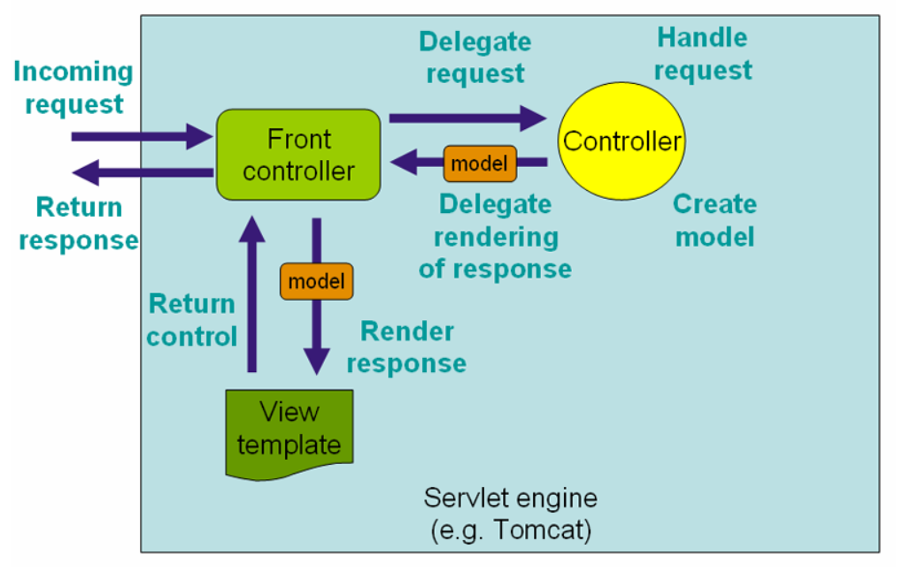

# 初识Spring Boot，开发社区首页

## 1. 搭建开发环境

### Apache Maven

* 可以帮助我们构建项目、管理项目中的jar包
* Maven仓库：存放构件的位置
  * 构件:创建项目时依赖的资源jar包.
  * 本地仓库：默认是 ~/.m2/repository
  * 远程仓库：中央仓库(官网)、镜像仓库(第三方网站)、私服仓库(公司自己搭建)
*  示例：安装、配置、常用命令
  * 下载 : http://maven.apache.org
  * 解压,配置conf文件夹下,settings.xml.修改为阿里云镜像仓库.<mirror>标签下修改网址.
  * 将bin文件路径配置到环境变量
  * 常用命令: 创建,编译(生成target文件夹),清除,测试.

### IntelliJ IDEA

* 目前最流行的Java集成开发工具
*  示例：安装、配置、创建项目
  * 下载: http://www.jetbrains.com/idea
  * Eclipse创建的项目需要导入(import),IDEA的直接open就可以.
  * Settings的Editor下设置maven及其配置文件.
  * 创建maven模板项目.
  * 重新编译 Ctrl+F9

### Spring Initializr

* 把包进行整合按功能划分归类.

* 创建 Spring Boot 项目的引导工具
  * https://start.spring.io
*  示例：创建“牛客社区”项目
  * springboot内嵌了Tomcat.

### Spring Boot 入门示例
*  Spring Boot 核心作用
  
* 起步依赖、自动配置、端点监控
  
* 示例:一个简单的处理客户端请求案例

  * application.properties文件进行配置

    ``````
    # ServerProperties
    server.port=8080         服务器端口
    server.servlet.context-path=/community  项目访问路径
    ``````

## 2. Spring入门

### Spring全家桶
* Spring Framework 
* Spring Boot
* Spring Cloud (微服务,大项目拆分成若干子项目)
* Spring Cloud Data Flow(数据集成)
*  官网: https://spring.io

### Spring Framework
* Spring Core

* IoC、AOP  (管理对象的思想,spring管理的对象叫做Bean.)

* Spring Data Access
  * Transactions(事务)、Spring MyBatis
* Web Servlet
  * Spring MVC
* Integration(集成)
  * Email、Scheduling(定时任务)、AMQP(消息队列)、Security(安全控制)

### Spring IoC
* Inversion of Control
  * 控制反转，是一种面向对象编程的设计思想。
*  Dependency Injection
  * 依赖注入，是IoC思想的实现方式。
*  IoC Container
  * IoC容器，是实现依赖注入的关键，本质上是一个工厂。
  * 容器管理Bean的前提:提供Bean的类型,通过配置文件配置Bean之间的关系.
  * 降低Bean之间的耦合度

### 代码部分

* 主动获取:

``````
@SpringBootApplication
public class CommunityApplication {
	public static void main(String[] args) {
		SpringApplication.run(CommunityApplication.class, args);
	}
}
配置类,启动时自动扫描,扫描配置类所在的包以及子包下的Bean.
@Component @Repository @Service @Controller
``````

测试代码要以其为配置类,需加上注解:

``````
@ContextConfiguration(classes = CommunityApplication.class)
``````

想要使用spring容器需要实现接口,ApplicationContextAware,实现接口中set方法.传入参数applicationContext(spring容器),他是一个接口,继承自BeanFactory.

获取Bean:applicationContext.getBean(test.class);

``````
public class CommunityApplicationTests implements ApplicationContextAware {

	private ApplicationContext applicationContext;

	@Override
	public void setApplicationContext(ApplicationContext applicationContext) throws BeansException {
		this.applicationContext = applicationContext;
	}
}
``````

给Bean自定义名字:@Component("名字")

初始化方法@PostConstruct,在构造器之后调用.销毁对象之前调用,@PreDestroy.

@Scope()指定单例多例

@Configuration配置类,用以装载使用第三方类.

* 自动注入:
  * @Autowired

## 3. Spring MVC入门

### HTTP
* HyperText Transfer Protocol
* 用于传输HTML等内容的应用层协议
* 规定了浏览器和服务器之间如何通信，以及通信时的数据格式。
* 学习网站：https://developer.mozilla.org/zh-CN

浏览器服务器通信步骤：

1. 打开一个TCP连接
2. 发生一个HTTP报文 
3. 读取服务器返回的报文信息
4. 关闭连接或为后续请求重用连接

- 按下F12进入调试，在Network下看请求响应（Header和Response）

### Spring MVC

* 三层架构
  * 表现层(mvc)、业务层、数据访问层

*  MVC(设计模式)
  * Model：模型层
  * View：视图层
  * Controller：控制层

* 核心组件
  * 前端控制器：DispatcherServlet

浏览器访问服务器，首先访问的时Controller控制层，Controller调用业务层处理，处理完后将得到的数据封装到Model,传给视图层。

 

### Thymeleaf
* 模板引擎
  * 生成动态的HTML。
*  Thymeleaf
  * 倡导自然模板，即以HTML文件为模板。
* 常用语法
  * 标准表达式、判断与循环、模板的布局。

### 代码部分

底层：

```java
@RequestMapping("/http")
public void http(HttpServletRequest request, HttpServletResponse response) {
    // 获取请求数据
    System.out.println(request.getMethod());
    System.out.println(request.getServletPath());
    Enumeration<String> enumeration = request.getHeaderNames();
    while (enumeration.hasMoreElements()) {
        String name = enumeration.nextElement();
        String value = request.getHeader(name);
        System.out.println(name + ": " + value);
    }
    System.out.println(request.getParameter("code"));

    // 返回响应数据
    response.setContentType("text/html;charset=utf-8");
    try (
        PrintWriter writer = response.getWriter();
    ) {
        writer.write("<h1>xx网</h1>");
    } catch (IOException e) {
        e.printStackTrace();
    }
}
```

从路径中得到变量GET（两种方法）：

```java
@RequestMapping(path = "/students", method = RequestMethod.GET)
@ResponseBody
public String getStudents(
    @RequestParam(name = "current", required = false, defaultValue = "1") int current,
    @RequestParam(name = "limit", required = false, defaultValue = "10") int limit) {
    System.out.println(current);
    System.out.println(limit);
    return "some students";
}

@RequestMapping(path = "/student/{id}", method = RequestMethod.GET)
@ResponseBody
public String getStudent(@PathVariable("id") int id) {
    System.out.println(id);
    return "a student";
}
```

POST请求:

``````java
@RequestMapping(path = "/student", method = RequestMethod.POST)
@ResponseBody
public String saveStudent(String name, int age) {
    System.out.println(name);
    System.out.println(age);
    return "success";
}
``````

响应HTML数据(使用ModelAndView或Model):

``````java
@RequestMapping(path = "/teacher", method = RequestMethod.GET)
public ModelAndView getTeacher() {
    ModelAndView mav = new ModelAndView();
    mav.addObject("name", "张三");
    mav.addObject("age", 30);
    mav.setViewName("/demo/view");
    return mav;
}

@RequestMapping(path = "/school", method = RequestMethod.GET)
public String getSchool(Model model) {
    model.addAttribute("name", "北京大学");
    model.addAttribute("age", 80);
    return "/demo/view";
}
``````

 响应JSON数据(异步请求)：Java对象 -> JSON字符串 -> JS对象,使用@ResponseBody注解

``````java
@RequestMapping(path = "/emp", method = RequestMethod.GET)
@ResponseBody
public Map<String, Object> getEmp() {
    Map<String, Object> emp = new HashMap<>();
    emp.put("name", "张三");
    emp.put("age", 23);
    return emp;
}
//转换为json字符串  {"name":"张三","age":"23"}
//也可以返回List<Map<String, Object>>，list集合。
``````

响应list

```java
    // 相应一个List集合
    @RequestMapping(path = "/emps", method = RequestMethod.GET)
    @ResponseBody
    public List<Map<String, Object>> getEmps() {
        List<Map<String, Object>> list = new ArrayList<>();

        Map<String, Object> emp = new HashMap<>();
        emp.put("name", "张三");
        emp.put("age", 23);
        emp.put("salary", 8000.00);
        list.add(emp);

        emp = new HashMap<>();
        emp.put("name", "李四");
        emp.put("age", 24);
        emp.put("salary", 9000.00);
        list.add(emp);

        emp = new HashMap<>();
        emp.put("name", "王五");
        emp.put("age", 25);
        emp.put("salary", 10000.00);
        list.add(emp);

        return list;
    }
```


## 5. MyBatis入门

### 安装数据库

* 安装MySQL Server
*  安装MySQL Workbench

### MyBatis
* 核心组件
  * SqlSessionFactory：用于创建SqlSession的工厂类。
  * SqlSession：MyBatis的核心组件，用于向数据库执行SQL。
  * 主配置文件：XML配置文件，可以对MyBatis的底层行为做出详细的配置。
  * Mapper接口：就是DAO接口，在MyBatis中习惯性的称之为Mapper。
  * Mapper映射器：用于编写SQL，并将SQL和实体类映射的组件，采用XML、注解均可实现。

* 示例
  * 使用MyBatis对用户表进行CRUD操作。

* 在application.properties中配置数据库、Mybatis相关。

## 6. 开发社区首页
* 开发流程
  * 1次请求的执行过程
*  分步实现
  * 开发社区首页，显示前10个帖子
  * 开发分页组件，分页显示所有的帖子


## 7. 项目调试技巧
* 响应状态码的含义

  

  | 状态码 | 状态码英文名称                  | 中文描述                                                     |
  | :----- | :------------------------------ | :----------------------------------------------------------- |
  | 100    | Continue                        | 继续。客户端应继续其请求                                     |
  | 101    | Switching Protocols             | 切换协议。服务器根据客户端的请求切换协议。只能切换到更高级的协议，例如，切换到HTTP的新版本协议 |
  |        |                                 |                                                              |
  | 200    | OK                              | 请求成功。一般用于GET与POST请求                              |
  | 201    | Created                         | 已创建。成功请求并创建了新的资源                             |
  | 202    | Accepted                        | 已接受。已经接受请求，但未处理完成                           |
  | 203    | Non-Authoritative Information   | 非授权信息。请求成功。但返回的meta信息不在原始的服务器，而是一个副本 |
  | 204    | No Content                      | 无内容。服务器成功处理，但未返回内容。在未更新网页的情况下，可确保浏览器继续显示当前文档 |
  | 205    | Reset Content                   | 重置内容。服务器处理成功，用户终端（例如：浏览器）应重置文档视图。可通过此返回码清除浏览器的表单域 |
  | 206    | Partial Content                 | 部分内容。服务器成功处理了部分GET请求                        |
  |        |                                 |                                                              |
  | 300    | Multiple Choices                | 多种选择。请求的资源可包括多个位置，相应可返回一个资源特征与地址的列表用于用户终端（例如：浏览器）选择 |
  | 301    | Moved Permanently               | 永久移动。请求的资源已被永久的移动到新URI，返回信息会包括新的URI，浏览器会自动定向到新URI。今后任何新的请求都应使用新的URI代替 |
  | 302    | Found                           | 临时移动。与301类似。但资源只是临时被移动。客户端应继续使用原有URI |
  | 303    | See Other                       | 查看其它地址。与301类似。使用GET和POST请求查看               |
  | 304    | Not Modified                    | 未修改。所请求的资源未修改，服务器返回此状态码时，不会返回任何资源。客户端通常会缓存访问过的资源，通过提供一个头信息指出客户端希望只返回在指定日期之后修改的资源 |
  | 305    | Use Proxy                       | 使用代理。所请求的资源必须通过代理访问                       |
  | 306    | Unused                          | 已经被废弃的HTTP状态码                                       |
  | 307    | Temporary Redirect              | 临时重定向。与302类似。使用GET请求重定向                     |
  |        |                                 |                                                              |
  | 400    | Bad Request                     | 客户端请求的语法错误，服务器无法理解                         |
  | 401    | Unauthorized                    | 请求要求用户的身份认证                                       |
  | 402    | Payment Required                | 保留，将来使用                                               |
  | 403    | Forbidden                       | 服务器理解请求客户端的请求，但是拒绝执行此请求               |
  | 404    | Not Found                       | 服务器无法根据客户端的请求找到资源（网页）。通过此代码，网站设计人员可设置"您所请求的资源无法找到"的个性页面 |
  | 405    | Method Not Allowed              | 客户端请求中的方法被禁止                                     |
  | 406    | Not Acceptable                  | 服务器无法根据客户端请求的内容特性完成请求                   |
  | 407    | Proxy Authentication Required   | 请求要求代理的身份认证，与401类似，但请求者应当使用代理进行授权 |
  | 408    | Request Time-out                | 服务器等待客户端发送的请求时间过长，超时                     |
  | 409    | Conflict                        | 服务器完成客户端的 PUT 请求时可能返回此代码，服务器处理请求时发生了冲突 |
  | 410    | Gone                            | 客户端请求的资源已经不存在。410不同于404，如果资源以前有现在被永久删除了可使用410代码，网站设计人员可通过301代码指定资源的新位置 |
  | 411    | Length Required                 | 服务器无法处理客户端发送的不带Content-Length的请求信息       |
  | 412    | Precondition Failed             | 客户端请求信息的先决条件错误                                 |
  | 413    | Request Entity Too Large        | 由于请求的实体过大，服务器无法处理，因此拒绝请求。为防止客户端的连续请求，服务器可能会关闭连接。如果只是服务器暂时无法处理，则会包含一个Retry-After的响应信息 |
  | 414    | Request-URI Too Large           | 请求的URI过长（URI通常为网址），服务器无法处理               |
  | 415    | Unsupported Media Type          | 服务器无法处理请求附带的媒体格式                             |
  | 416    | Requested range not satisfiable | 客户端请求的范围无效                                         |
  | 417    | Expectation Failed              | 服务器无法满足Expect的请求头信息                             |
  |        |                                 |                                                              |
  | 500    | Internal Server Error           | 服务器内部错误，无法完成请求                                 |
  | 501    | Not Implemented                 | 服务器不支持请求的功能，无法完成请求                         |
  | 502    | Bad Gateway                     | 作为网关或者代理工作的服务器尝试执行请求时，从远程服务器接收到了一个无效的响应 |
  | 503    | Service Unavailable             | 由于超载或系统维护，服务器暂时的无法处理客户端的请求。延时的长度可包含在服务器的Retry-After头信息中 |
  | 504    | Gateway Time-out                | 充当网关或代理的服务器，未及时从远端服务器获取请求           |
  | 505    | HTTP Version not supported      | 服务器不支持请求的HTTP协议的版本，无法完成处理               |

* 服务端断点调试技巧

* 客户端断点调试技巧

* 设置日志级别，并将日志输出到不同的终端,springboot默认启动日志的工具是logback，它的接口是Logger

  如果启用info级别的日志，那么就不会打印等级 < info的日志

  - ```
    public interface Logger{
        日志级别。依次严重
        public void trace (string message) ;//跟踪
        public void debug (string message) ;//调试
        public void info (string message) ;//普通
        public void warn (string message) ;
        public void error(string message) ;}
    ```

  -  在application.properties声明日志权限

    ```
    # logger,把这个包下的日志级别调为debug,那么只会打印日志级别大于这个的日志，加上这个就能在控制台打印看到拼接的sql语句了
    logging.level.com.zhang.forum=debug
    logging.file.name =D:\\forum\\logger.log
    ```

  - 测试logger

    ```
    @RunWith(SpringRunner.class)
    @SpringBootTest
    @ContextConfiguration(classes = ForumApplication.class)
    public class LoggerTests {
    
        //便于调用，设置为静态的
        private static final Logger logger = LoggerFactory.getLogger(LoggerTests.class);
    
        @Test
        public void testLogger(){
            System.out.println(logger.getName());//看日志的名字
            logger.debug("debug log");//最低级别日志
            logger.info("info log");//普通日志
            logger.warn("warn log");//警告日志
            logger.error("error log");//错误日志
        }
    }
    ```

  - 将各个日志分别存到不同的文件下，当文件达到5M后就拆分，分页，这就需要在resources下写一个logback-spring.xml文件。只要是这个名字，springboot就会自动配置这个文件。

    ```
    <?xml version="1.0" encoding="UTF-8"?>
    <configuration>
        <contextName>forum</contextName>
        <property name="LOG_PATH" value="D:/work/data"/>
        <property name="APPDIR" value="forum"/>
    
        <!-- error file -->
        <appender name="FILE_ERROR" class="ch.qos.logback.core.rolling.RollingFileAppender">
            <file>${LOG_PATH}/${APPDIR}/log_error.log</file>
    
    <!--        如果上面这个文件存到一定容量，再新建一个-->
            <rollingPolicy class="ch.qos.logback.core.rolling.TimeBasedRollingPolicy">
                <fileNamePattern>${LOG_PATH}/${APPDIR}/error/log-error-%d{yyyy-MM-dd}.%i.log</fileNamePattern>
                <timeBasedFileNamingAndTriggeringPolicy class="ch.qos.logback.core.rolling.SizeAndTimeBasedFNATP">
                    <maxFileSize>5MB</maxFileSize>
                </timeBasedFileNamingAndTriggeringPolicy>
    <!--            超过30天就清除-->
                <maxHistory>30</maxHistory>
            </rollingPolicy>
    <!--        以追加形式存日志，而不是覆盖-->
            <append>true</append>
            <encoder class="ch.qos.logback.classic.encoder.PatternLayoutEncoder">
                <pattern>%d %level [%thread] %logger{10} [%file:%line] %msg%n</pattern>
                <charset>utf-8</charset>
            </encoder>
    <!--        一个过滤器：什么样的级别的日志才会被记录-->
            <filter class="ch.qos.logback.classic.filter.LevelFilter">
                <level>error</level>
                <onMatch>ACCEPT</onMatch>
                <onMismatch>DENY</onMismatch>
            </filter>
        </appender>
    
        <!-- warn file -->
        <appender name="FILE_WARN" class="ch.qos.logback.core.rolling.RollingFileAppender">
            <file>${LOG_PATH}/${APPDIR}/log_warn.log</file>
            <rollingPolicy class="ch.qos.logback.core.rolling.TimeBasedRollingPolicy">
                <fileNamePattern>${LOG_PATH}/${APPDIR}/warn/log-warn-%d{yyyy-MM-dd}.%i.log</fileNamePattern>
                <timeBasedFileNamingAndTriggeringPolicy class="ch.qos.logback.core.rolling.SizeAndTimeBasedFNATP">
                    <maxFileSize>5MB</maxFileSize>
                </timeBasedFileNamingAndTriggeringPolicy>
                <maxHistory>30</maxHistory>
            </rollingPolicy>
            <append>true</append>
            <encoder class="ch.qos.logback.classic.encoder.PatternLayoutEncoder">
                <pattern>%d %level [%thread] %logger{10} [%file:%line] %msg%n</pattern>
                <charset>utf-8</charset>
            </encoder>
            <filter class="ch.qos.logback.classic.filter.LevelFilter">
                <level>warn</level>
                <onMatch>ACCEPT</onMatch>
                <onMismatch>DENY</onMismatch>
            </filter>
        </appender>
    
        <!-- info file -->
        <appender name="FILE_INFO" class="ch.qos.logback.core.rolling.RollingFileAppender">
            <file>${LOG_PATH}/${APPDIR}/log_info.log</file>
            <rollingPolicy class="ch.qos.logback.core.rolling.TimeBasedRollingPolicy">
                <fileNamePattern>${LOG_PATH}/${APPDIR}/info/log-info-%d{yyyy-MM-dd}.%i.log</fileNamePattern>
                <timeBasedFileNamingAndTriggeringPolicy class="ch.qos.logback.core.rolling.SizeAndTimeBasedFNATP">
                    <maxFileSize>5MB</maxFileSize>
                </timeBasedFileNamingAndTriggeringPolicy>
                <maxHistory>30</maxHistory>
            </rollingPolicy>
            <append>true</append>
            <encoder class="ch.qos.logback.classic.encoder.PatternLayoutEncoder">
                <pattern>%d %level [%thread] %logger{10} [%file:%line] %msg%n</pattern>
                <charset>utf-8</charset>
            </encoder>
            <filter class="ch.qos.logback.classic.filter.LevelFilter">
                <level>info</level>
                <onMatch>ACCEPT</onMatch>
                <onMismatch>DENY</onMismatch>
            </filter>
        </appender>
    
        <!-- console -->
    <!--    把debug日志打印到控制台，方便调试-->
        <appender name="STDOUT" class="ch.qos.logback.core.ConsoleAppender">
            <encoder>
                <pattern>%d %level [%thread] %logger{10} [%file:%line] %msg%n</pattern>
                <charset>utf-8</charset>
            </encoder>
            <filter class="ch.qos.logback.classic.filter.ThresholdFilter">
                <level>debug</level>
            </filter>
        </appender>
    
        <logger name="com.zhang.forum" level="debug"/>
    
    <!--    根目录下的日志最少为info-->
        <root level="info">
            <appender-ref ref="FILE_ERROR"/>
            <appender-ref ref="FILE_WARN"/>
            <appender-ref ref="FILE_INFO"/>
            <appender-ref ref="STDOUT"/>
        </root>
    
    </configuration>
    ```

    

## 8. 版本控制

* 认识Git
  * Git简介
  * Git的安装与配置
* Git常用命令
  * 将代码提交至本地仓库
  * 将代码上传至远程仓库
* IDEA集成Git
  * 在IDEA中配置并使用Git

```c
# 账号配置
git config --list
git config --global user.name "mywang"
git config --global user.email "1311025321@qq.com"
# 本地仓库
git init
git status -s
git add *
git commit -m '...'
# 生成秘钥
ssh-keygen -t rsa -C "1311025321@qq.com"
# 推送已有项目
git remote add origin
https://git.nowcoder.com/334190970/Test.git
git push -u origin master
# 克隆已有仓库
git clone https://git.nowcoder.com/334190970/Test.git
```


